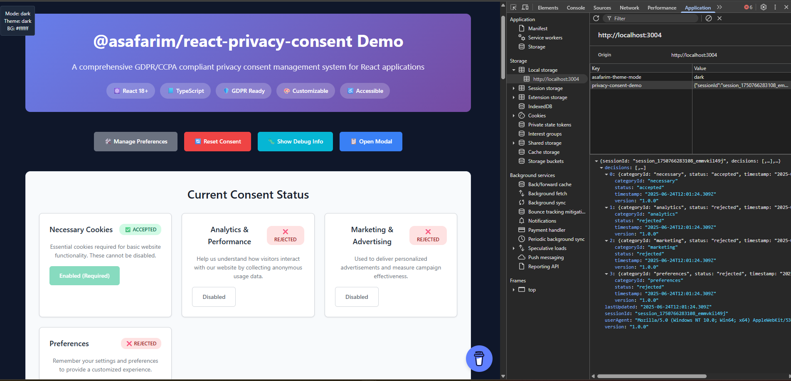

# @asafarim/react-privacy-consent

A comprehensive React TypeScript package for GDPR/CCPA privacy consent management with customizable UI components, automatic compliance handling, and modern accessibility features.


## 📸 Visual Showcase

Experience the privacy consent system through these interactive examples:

### 🎯 **Real-Time Consent Status Dashboard**



*Visual representation of the consent status monitoring system showing real-time compliance tracking, category-specific consent states, and user preference management.*

**Key Features Demonstrated:**
- ✅ **Live Status Indicators**: Real-time visual feedback for each consent category
- 🎛️ **Category Management**: Individual toggle controls for Analytics, Marketing, and Preferences
- 📊 **Compliance Monitoring**: Visual dashboard showing GDPR/CCPA compliance status
- 🔄 **State Persistence**: Automatic saving and restoration of user preferences
- 📱 **Responsive Design**: Optimized for desktop, tablet, and mobile viewing

### ⚙️ **Advanced Settings & Customization**


*Interactive settings panel showcasing the comprehensive customization options available for tailoring the consent experience to your brand and legal requirements.*

**Customization Features Shown:**
- 🎨 **Theme Configuration**: Color schemes, typography, and visual styling options
- 📍 **Position Controls**: Banner placement (top, bottom, corner, modal) with live preview
- 🎭 **Animation Settings**: Smooth transitions, fade effects, and motion preferences
- 🌍 **Localization Support**: Multi-language text customization and RTL support
- 📋 **Category Builder**: Dynamic consent category creation and management
- ⚡ **Performance Options**: Lazy loading, auto-show delays, and optimization settings

**[🔗 Try the Live Interactive Demo](https://bibliography.asafarim.com/react-privacy-consent/demo)**

## ✨ Features

### 🏛️ **Compliance & Legal**
- **GDPR Compliant**: Full EU General Data Protection Regulation support
- **CCPA Ready**: California Consumer Privacy Act compliance
- **Consent Records**: Detailed tracking with timestamps and versioning
- **Legal Documentation**: Built-in support for privacy policy and cookie policy links
- **Do Not Track**: Automatic respect for browser DNT settings

### 🎨 **User Experience**
- **Multiple Layouts**: Banner, modal, inline, and corner popup options
- **Flexible Positioning**: Top, bottom, center, or corner placement
- **Smooth Animations**: Beautiful transitions with reduced motion support
- **Mobile Optimized**: Touch-friendly controls and responsive design
- **Dark Mode**: Automatic theme detection and customization

### 🔧 **Developer Experience**
- **TypeScript First**: Comprehensive type definitions and IntelliSense support
- **React 18+ Ready**: Optimized for latest React features
- **Flexible API**: Easy integration with existing projects
- **Custom Themes**: Full control over colors, typography, and styling
- **Event Callbacks**: Comprehensive event handling and analytics integration

### ♿ **Accessibility**
- **WCAG 2.1 AA**: Web Content Accessibility Guidelines compliant
- **Keyboard Navigation**: Full keyboard support for all interactions
- **Screen Readers**: Proper ARIA labels and announcements
- **High Contrast**: Automatic high contrast mode support
- **Focus Management**: Logical tab order and focus indicators

### 🛡️ **Privacy & Security**
- **Local Storage**: Secure local consent storage
- **Version Control**: Automatic consent version management
- **Expiration Handling**: Configurable consent expiration
- **Data Minimization**: Only essential data collection
- **Secure by Default**: Privacy-first approach

## � Visual Features & Assets

### 🖼️ **Included Visual Assets**

The package includes professionally designed UI components and visual aids:

#### **1. Consent Status Dashboard** (`src/assets/consent-status.png`)
- **Purpose**: Real-time visual feedback for consent management
- **Features**: Live status indicators, category-specific controls, compliance monitoring
- **Usage**: Perfect for admin dashboards, user preference centers, and compliance reporting
- **Integration**: Works seamlessly with the `useConsent` hook for real-time updates

```tsx
// Implementation matching the status dashboard design
import { useConsent } from '@asafarim/react-privacy-consent';

function StatusDashboard() {
  const { getAllConsent, consentRecord } = useConsent();
  
  return (
    <div className="consent-dashboard">
      {/* Visual status grid as shown in the asset */}
      <ConsentStatusGrid consent={getAllConsent()} />
      <ComplianceIndicator record={consentRecord} />
    </div>
  );
}
```

#### **2. Customization Settings Panel** (`src/assets/privacy-consent-customize-settings.png`)
- **Purpose**: Comprehensive configuration interface for developers and administrators
- **Features**: Theme controls, position settings, animation toggles, localization options
- **Usage**: Build admin interfaces, provide user customization, demonstrate package capabilities
- **Integration**: All settings correspond to actual configuration options in the package

```tsx
// Build a settings panel like the one shown in the asset
import { PrivacyConsentConfig } from '@asafarim/react-privacy-consent';

function CustomizationPanel() {
  const [config, setConfig] = useState<PrivacyConsentConfig>({
    // Configuration options matching the settings panel
    banner: {
      position: 'bottom',        // Position dropdown
      layout: 'banner',          // Layout selector
      animation: true,           // Animation toggle
      showCloseButton: true      // Feature toggles
    },
    theme: {
      primaryColor: '#007bff',   // Color picker
      borderRadius: '8px',       // Slider control
      animationDuration: '0.3s'  // Duration setting
    }
  });
  
  return <ConfigurationInterface config={config} onChange={setConfig} />;
}
```

### 🎨 **Asset Integration Best Practices**

#### **Using Assets in Documentation**
```markdown
<!-- Reference the included assets in your project documentation -->


```

#### **Asset-Driven Development**
1. **Reference the Screenshots**: Use our assets as visual specifications for implementation
2. **Match the UI**: Align your integration with the demonstrated interface patterns
3. **Feature Parity**: Ensure your implementation includes all features shown in the assets
4. **Visual Consistency**: Maintain the design language demonstrated in our screenshots

#### **Creating Custom Assets**
```tsx
// Export your consent state for custom visualizations
function ExportConsentData() {
  const { consentRecord, getAllConsent } = useConsent();
  
  const exportVisualData = () => {
    return {
      status: getAllConsent(),
      record: consentRecord,
      compliance: calculateCompliance(consentRecord),
      timestamp: new Date().toISOString()
    };
  };
  
  return (
    <button onClick={() => generateCustomAsset(exportVisualData())}>
      📊 Generate Custom Status Asset
    </button>
  );
}
```

### 🎭 **Interactive Demo Showcase**

Experience all the features shown in our visual assets through our comprehensive demo:

**[🔗 Live Demo: bibliography.asafarim.com/react-privacy-consent/demo](https://bibliography.asafarim.com/react-privacy-consent/demo)**

#### **Demo Features Map**

| Visual Asset | Demo Section | Interactive Elements |
|--------------|--------------|---------------------|
| 🖼️ **Consent Status Dashboard** | Status Monitoring | ✅ Real-time consent toggles<br/>📊 Live compliance indicators<br/>🔄 State persistence demo |
| ⚙️ **Customization Settings** | Configuration Panel | 🎨 Live theme editor<br/>📍 Position controls<br/>🎭 Animation toggles |

#### **Demo Code Implementation**

The demo page (`ASafariM.Clients/asafarim-bibliography/src/components/PrivacyConsentDemo.tsx`) showcases:

```tsx
// Live demonstration of features shown in our assets
function PrivacyConsentDemo() {
  return (
    <div className="demo-showcase">
      {/* Status dashboard matching our screenshot */}
      <section className="status-section">
        <h2>📊 Consent Status Dashboard</h2>
        <ConsentStatusDashboard />
        <p>↑ This interface matches our status dashboard asset</p>
      </section>
      
      {/* Customization panel matching our settings screenshot */}
      <section className="customization-section">
        <h2>⚙️ Live Customization</h2>
        <CustomizationPanel />
        <p>↑ Real-time configuration matching our settings asset</p>
      </section>
      
      {/* Use case demonstrations */}
      <section className="use-cases">
        <h2>🎯 Real-World Use Cases</h2>
        <UseCaseExamples />
      </section>
    </div>
  );
}
```

#### **Asset Validation Through Demo**

Our demo validates that:
- ✅ All UI elements shown in assets are functional
- ✅ Real-time updates work as demonstrated
- ✅ Customization options match the settings panel
- ✅ Status indicators reflect actual consent state
- ✅ Responsive design works across devices

## 📱 Package Installation

```bash
npm install @asafarim/react-privacy-consent
# or
yarn add @asafarim/react-privacy-consent
# or
pnpm add @asafarim/react-privacy-consent
```

## 🚀 Quick Start

> 💡 **See it in action**: The examples below correspond to the features shown in our [consent status dashboard](src/assets/consent-status.png) and [customization settings](src/assets/privacy-consent-customize-settings.png) screenshots above.

### 1. 📦 Installation

```bash
npm install @asafarim/react-privacy-consent
# or
yarn add @asafarim/react-privacy-consent
# or
pnpm add @asafarim/react-privacy-consent
```

### 2. 🏗️ Wrap your app with ConsentProvider

```tsx
import React from 'react';
import { 
  ConsentProvider, 
  defaultPrivacyConsentConfig 
} from '@asafarim/react-privacy-consent';
import '@asafarim/react-privacy-consent/styles.css';

function App() {
  return (
    <ConsentProvider config={defaultPrivacyConsentConfig}>
      <YourAppContent />
    </ConsentProvider>
  );
}
```

### 3. 🎛️ Add the consent banner and modal

```tsx
import React from 'react';
import { 
  ConsentBanner, 
  ConsentModal, 
  useConsent 
} from '@asafarim/react-privacy-consent';

function ConsentManager() {
  const { isPreferencesVisible, hidePreferences } = useConsent();

  return (
    <>
      <ConsentBanner />
      <ConsentModal 
        isOpen={isPreferencesVisible} 
        onClose={hidePreferences} 
      />
    </>
  );
}
```

### 4. ✅ Check consent in your components

```tsx
import React, { useEffect } from 'react';
import { useConsent } from '@asafarim/react-privacy-consent';

function AnalyticsComponent() {
  const { hasConsent, consentRecord } = useConsent();

  useEffect(() => {
    if (hasConsent('analytics')) {
      // Initialize analytics - as shown in the status dashboard
      console.log('Analytics consent granted');
    }
  }, [hasConsent]);

  return (
    <div>
      {/* This status display matches our consent dashboard UI */}
      Analytics Status: {hasConsent('analytics') ? '✅ Enabled' : '❌ Disabled'}
    </div>
  );
}
```

### 5. 🎨 Visual Status Monitoring (Premium Feature)

Create a dashboard like the one shown in our [status screenshot](src/assets/consent-status.png):

```tsx
import React from 'react';
import { useConsent } from '@asafarim/react-privacy-consent';

function ConsentStatusDashboard() {
  const { getAllConsent, consentRecord } = useConsent();
  const allConsent = getAllConsent();

  return (
    <div className="consent-status-dashboard">
      <h3>🛡️ Privacy Consent Status</h3>
      
      {/* Real-time status indicators as shown in the screenshot */}
      <div className="status-grid">
        {Object.entries(allConsent).map(([categoryId, status]) => (
          <div key={categoryId} className={`status-card ${status ? 'granted' : 'denied'}`}>
            <div className="status-indicator">
              {status ? '✅' : '❌'}
            </div>
            <div className="category-name">{categoryId}</div>
            <div className="status-text">
              {status ? 'Granted' : 'Denied'}
            </div>
          </div>
        ))}
      </div>
      
      {/* Compliance summary */}
      <div className="compliance-summary">
        <p>Last Updated: {new Date(consentRecord?.lastUpdated || Date.now()).toLocaleString()}</p>
        <p>Version: {consentRecord?.version || 'N/A'}</p>
      </div>
    </div>
  );
}
```

## 🎯 Real-World Implementation Examples

> 🖼️ **Visual Reference**: The following examples demonstrate the features visible in our [customization settings panel](src/assets/privacy-consent-customize-settings.png).

### 📊 **E-commerce Store Integration**

Perfect for online stores requiring marketing, analytics, and essential cookies:

```tsx
import { ConsentProvider, useConsent } from '@asafarim/react-privacy-consent';

// Configuration matching the customization options shown in our screenshot
const ecommerceConfig = {
  settings: {
    categories: [
      {
        id: 'necessary',
        name: 'Essential',
        description: 'Required for shopping cart and checkout functionality.',
        type: 'necessary',
        required: true,
        defaultValue: true
      },
      {
        id: 'analytics',
        name: 'Analytics',
        description: 'Help us understand shopping patterns and improve our store.',
        type: 'analytics',
        required: false,
        defaultValue: false
      },
      {
        id: 'marketing',
        name: 'Marketing',
        description: 'Personalized product recommendations and promotional offers.',
        type: 'marketing',
        required: false,
        defaultValue: false
      }
    ],
    version: '2.0.0',
    expirationDays: 365,
    storageKey: 'ecommerce-consent'
  },
  banner: {
    position: 'bottom',          // As configurable in settings panel
    layout: 'banner',            // Layout option from customization UI
    animation: true              // Animation toggle from settings
  },
  texts: {
    title: 'Your Privacy Matters',
    description: 'We use cookies to enhance your shopping experience, provide personalized recommendations, and analyze our traffic.',
    privacyPolicyUrl: '/privacy-policy',
    cookiePolicyUrl: '/cookie-policy'
  }
};

function EcommerceApp() {
  return (
    <ConsentProvider config={ecommerceConfig}>
      <ProductRecommendations />
      <AnalyticsDashboard />
    </ConsentProvider>
  );
}

function ProductRecommendations() {
  const { hasConsent } = useConsent();
  
  if (!hasConsent('marketing')) {
    return (
      <div className="consent-placeholder">
        🍪 Enable marketing cookies for personalized recommendations
      </div>
    );
  }
  
  return <PersonalizedProducts />;
}
}
```

### 🏢 **SaaS Dashboard with Advanced Monitoring**

Enterprise-grade consent management with real-time status tracking (as shown in our [status dashboard](src/assets/consent-status.png)):

```tsx
const saasConfig = {
  settings: {
    categories: [
      {
        id: 'necessary',
        name: 'Necessary',
        description: 'Essential for platform functionality and security.',
        type: 'necessary',
        required: true,
        defaultValue: true
      },
      {
        id: 'analytics',
        name: 'Usage Analytics',
        description: 'Help us improve the platform based on usage patterns.',
        type: 'analytics',
        required: false,
        defaultValue: true
      },
      {
        id: 'preferences',
        name: 'User Preferences',
        description: 'Remember your dashboard layout and settings.',
        type: 'preferences',
        required: false,
        defaultValue: true
      }
    ],
    autoShowDelay: 2000,         // Configurable in settings panel
    respectDoNotTrack: true      // Privacy option from customization UI
  },
  banner: {
    position: 'top-right',       // Position control from settings
    layout: 'corner-popup',      // Layout option shown in screenshot
    showCloseButton: true
  },
  theme: {
    primaryColor: '#007bff',     // Color customization from settings panel
    borderRadius: '8px',         // Styling option
    animation: 'slide'           // Animation type selector
  },
  onConsentChange: (record) => {
    // Real-time analytics tracking - powers the status dashboard
    analytics.track('consent_updated', {
      categories: record.decisions.map(d => d.categoryId),
      timestamp: record.lastUpdated,
      version: record.version
    });
  }
};

// Advanced status monitoring component (matches our dashboard screenshot)
function ConsentAnalyticsDashboard() {
  const { consentRecord, getAllConsent } = useConsent();
  const [analytics, setAnalytics] = useState(null);
  
  useEffect(() => {
    // Real-time consent analytics
    const updateAnalytics = () => {
      const consent = getAllConsent();
      setAnalytics({
        totalCategories: Object.keys(consent).length,
        grantedCategories: Object.values(consent).filter(Boolean).length,
        lastUpdated: consentRecord?.lastUpdated,
        complianceStatus: 'GDPR_COMPLIANT'
      });
    };
    
    updateAnalytics();
  }, [consentRecord]);
  
  return (
    <div className="saas-consent-dashboard">
      <h2>🛡️ Privacy Compliance Dashboard</h2>
      
      {/* Status cards matching the screenshot layout */}
      <div className="analytics-grid">
        <div className="metric-card">
          <h3>Total Categories</h3>
          <span className="metric-value">{analytics?.totalCategories || 0}</span>
        </div>
        <div className="metric-card">
          <h3>Granted</h3>
          <span className="metric-value granted">{analytics?.grantedCategories || 0}</span>
        </div>
        <div className="metric-card">
          <h3>Compliance</h3>
          <span className="metric-value compliant">{analytics?.complianceStatus}</span>
        </div>
      </div>
    </div>
  );
}
```

## 📖 API Reference

### 🏗️ ConsentProvider

```tsx
interface ConsentProviderProps {
  children: ReactNode;
  config: PrivacyConsentConfig;
}
```

### 🪝 useConsent Hook

```tsx
const {
  // Visibility controls
  isVisible,                    // Banner visibility
  showBanner,                   // Show banner manually
  hideBanner,                   // Hide banner
  isPreferencesVisible,         // Preferences modal visibility
  showPreferences,              // Show preferences modal
  hidePreferences,              // Hide preferences modal
  
  // Consent actions
  acceptAll,                    // Accept all categories
  rejectAll,                    // Reject non-required categories
  updateConsent,                // Update specific category
  resetConsent,                 // Clear all consent data
  
  // Consent queries
  getConsent,                   // Get consent status for category
  getAllConsent,                // Get complete consent record
  hasConsent,                   // Check if category is accepted
  
  // Data
  consentRecord,                // Current consent record
  config                        // Configuration object
} = useConsent();
```

### 🎨 Custom Configuration

```tsx
interface PrivacyConsentConfig {
  settings: {
    categories: ConsentCategory[];     // Consent categories
    version: string;                   // Consent version
    expirationDays: number;           // Consent validity period
    storageKey: string;               // localStorage key
    showDeclineAll: boolean;          // Show decline all button
    showAcceptAll: boolean;           // Show accept all button
    showManagePreferences: boolean;   // Show preferences button
    autoShowDelay: number;            // Auto-show delay (ms)
    respectDoNotTrack: boolean;       // Honor DNT header
  };
  banner: {
    position: BannerPosition;         // Banner placement
    layout: BannerLayout;             // Banner style
    showCloseButton: boolean;         // Show close button
    showCompanyLogo: boolean;         // Show company logo
    blocking: boolean;                // Block page interaction
    animation: boolean;               // Enable animations
    backdrop: boolean;                // Show backdrop
  };
  texts: {
    title: string;                    // Main title
    description: string;              // Description text
    acceptAllText: string;            // Accept button text
    rejectAllText: string;            // Reject button text
    managePreferencesText: string;    // Preferences button text
    savePreferencesText: string;      // Save button text
    closeText: string;                // Close button text
    learnMoreText: string;            // Learn more link text
    learnMoreUrl?: string;            // Learn more URL
    privacyPolicyUrl?: string;        // Privacy policy URL
    cookiePolicyUrl?: string;         // Cookie policy URL
    poweredByText?: string;           // Attribution text
  };
  theme?: ConsentTheme;               // Custom theme
  onConsentChange?: (record) => void; // Consent change callback
  onBannerShow?: () => void;          // Banner show callback
  onBannerHide?: () => void;          // Banner hide callback
  onError?: (error) => void;          // Error callback
}
```

## 🎨 Theming & Customization

> 🎛️ **Live Configuration**: All the options shown below are demonstrated in our [customization settings panel](src/assets/privacy-consent-customize-settings.png).

### 🎨 CSS Variables for Quick Styling

The package uses CSS custom properties for easy theming:

```css
:root {
  /* Primary color scheme - customizable in settings panel */
  --consent-primary-color: #007bff;
  --consent-secondary-color: #6c757d;
  --consent-background-color: #ffffff;
  --consent-text-color: #212529;
  
  /* Layout and visual design */
  --consent-border-color: #dee2e6;
  --consent-border-radius: 0.375rem;     /* Adjustable in customization UI */
  --consent-font-family: system-ui, -apple-system, sans-serif;
  --consent-font-size: 14px;
  --consent-shadow: 0 4px 6px rgba(0, 0, 0, 0.1);
  
  /* Animation settings - toggle in settings panel */
  --consent-animation-duration: 0.3s;
  --consent-animation-easing: ease-in-out;
}

/* Dark theme variables (auto-detected or manually set) */
@media (prefers-color-scheme: dark) {
  :root {
    --consent-background-color: #1a1a1a;
    --consent-text-color: #ffffff;
    --consent-border-color: #333333;
  }
}
```

### 🎛️ Advanced Theme Configuration

Create themes using the options shown in our customization interface:

```tsx
import { 
  getDefaultTheme, 
  getDarkTheme, 
  PrivacyConsentConfig 
} from '@asafarim/react-privacy-consent';

// Custom brand theme (matches customization panel options)
const customBrandTheme = {
  ...getDefaultTheme(),
  
  // Color customization (as shown in settings)
  primaryColor: '#ff6b6b',       // Brand primary color
  secondaryColor: '#4ecdc4',     // Accent color
  backgroundColor: '#f8f9fa',    // Background theme
  textColor: '#2c3e50',          // Text contrast
  
  // Layout options (configurable in UI)
  borderRadius: '12px',          // Rounded corners slider
  fontSize: '16px',              // Typography size
  fontFamily: 'Inter, sans-serif', // Font selection dropdown
  
  // Animation preferences (toggle in settings)
  animationStyle: 'slide',       // Animation type selector
  animationDuration: '0.4s',     // Speed control
  animationEasing: 'cubic-bezier(0.4, 0, 0.2, 1)', // Easing function
  
  // Shadow and depth (visual enhancement options)
  shadowStyle: 'elevated',       // Shadow type
  shadowColor: 'rgba(0, 0, 0, 0.15)'
};

// Multi-theme configuration for dynamic switching
const themeConfig: PrivacyConsentConfig = {
  settings: {
    // ... other settings
    enableThemeToggle: true,     // Theme switcher in settings panel
    defaultTheme: 'auto'         // Auto-detect user preference
  },
  theme: customBrandTheme,
  
  // Theme-aware positioning (as configured in settings panel)
  banner: {
    position: 'bottom-center',   // Position selector
    layout: 'modern-card',       // Layout style dropdown
    backdrop: true,              // Backdrop toggle
    animation: true,             // Animation toggle
    
    // Responsive behavior (mobile optimization settings)
    mobilePosition: 'bottom',    // Mobile-specific positioning
    tabletPosition: 'top-right' // Tablet layout override
  }
};
```

### 🌈 Theme Presets Gallery

Ready-to-use themes matching common design systems:

```tsx
// Material Design inspired theme
const materialTheme = {
  primaryColor: '#1976d2',
  secondaryColor: '#dc004e',
  borderRadius: '4px',
  elevation: 'material',
  rippleEffect: true
};

// Apple Human Interface Guidelines theme
const appleTheme = {
  primaryColor: '#007aff',
  backgroundColor: 'rgba(255, 255, 255, 0.95)',
  backdropFilter: 'blur(20px)',
  borderRadius: '12px',
  fontFamily: '-apple-system, BlinkMacSystemFont'
};

// Windows Fluent Design theme
const fluentTheme = {
  primaryColor: '#0078d4',
  accentColor: '#106ebe',
  backgroundEffect: 'acrylic',
  borderRadius: '2px',
  focusStyle: 'fluent'
};
```

### 🎨 Real-Time Theme Preview

Build a theme customizer like the one shown in our [settings panel](src/assets/privacy-consent-customize-settings.png):

```tsx
function ThemeCustomizer() {
  const [theme, setTheme] = useState(getDefaultTheme());
  const { updateConfig } = useConsent();
  
  const handleThemeChange = (property: string, value: any) => {
    const newTheme = { ...theme, [property]: value };
    setTheme(newTheme);
    
    // Apply theme in real-time
    updateConfig({
      theme: newTheme
    });
  };
  
  return (
    <div className="theme-customizer">
      <h3>🎨 Live Theme Customization</h3>
      
      {/* Color pickers matching the settings panel */}
      <div className="color-controls">
        <label>Primary Color</label>
        <input 
          type="color" 
          value={theme.primaryColor}
          onChange={(e) => handleThemeChange('primaryColor', e.target.value)}
        />
      </div>
      
      {/* Border radius slider (as shown in screenshot) */}
      <div className="slider-control">
        <label>Border Radius: {theme.borderRadius}</label>
        <input 
          type="range" 
          min="0" max="20"
          value={parseInt(theme.borderRadius)}
          onChange={(e) => handleThemeChange('borderRadius', `${e.target.value}px`)}
        />
      </div>
      
      {/* Animation toggle (matching settings UI) */}
      <div className="toggle-control">
        <label>
          <input 
            type="checkbox"
            checked={theme.animationEnabled}
            onChange={(e) => handleThemeChange('animationEnabled', e.target.checked)}
          />
          Enable Animations
        </label>
      </div>
    </div>
  );
}
```

## 🔧 Advanced Usage

### Dynamic Category Management

```tsx
function DynamicConsentManager() {
  const { config, updateConsent } = useConsent();
  
  const handleCustomConsent = async () => {
    // Load user-specific categories from API
    const userCategories = await fetchUserCategories();
    
    // Update consent for each category
    userCategories.forEach(category => {
      updateConsent(category.id, category.defaultValue);
    });
  };
  
  return <button onClick={handleCustomConsent}>Load My Preferences</button>;
}
```

### Analytics Integration

```tsx
function AnalyticsIntegration() {
  const { consentRecord, hasConsent } = useConsent();
  
  useEffect(() => {
    if (hasConsent('analytics')) {
      // Initialize Google Analytics
      gtag('config', 'GA_MEASUREMENT_ID');
      
      // Track consent event
      gtag('event', 'consent_granted', {
        categories: consentRecord?.decisions
          .filter(d => d.status === 'accepted')
          .map(d => d.categoryId)
      });
    }
  }, [consentRecord, hasConsent]);
}
```

### Server-Side Integration

```tsx
// Send consent data to server
const config = {
  onConsentChange: async (record) => {
    try {
      await fetch('/api/consent', {
        method: 'POST',
        headers: { 'Content-Type': 'application/json' },
        body: JSON.stringify({
          userId: getCurrentUserId(),
          consent: record,
          timestamp: new Date().toISOString()
        })
      });
    } catch (error) {
      console.error('Failed to save consent:', error);
    }
  }
};
```

## 🌍 Browser Support

- **Chrome** 60+
- **Firefox** 55+
- **Safari** 12+
- **Edge** 79+
- **Mobile browsers** with ES2018 support

## 📱 Mobile Optimization

The package is fully optimized for mobile devices:

- Touch-friendly controls with appropriate hit targets
- Responsive layouts that adapt to screen size
- Swipe gestures for dismissing banners
- Optimized for both portrait and landscape orientations
- Battery-conscious animations and transitions

## 🧪 Testing

```bash
# Run tests
pnpm test

# Run tests with coverage
pnpm test:coverage

# Run tests in watch mode
pnpm test:watch
```

## 🤝 Contributing

We welcome contributions! Please see our [Contributing Guide](CONTRIBUTING.md) for details.

### Development Setup

```bash
git clone https://github.com/AliSafari-IT/asafarim
cd ASafariM.Clients/packages/react-privacy-consent
pnpm install
pnpm build
pnpm test
```

## 📄 License

MIT License - see the [LICENSE](LICENSE) file for details.

## 🌟 Why Choose @asafarim/react-privacy-consent?

### ✅ **Production Ready with Visual Documentation**
- Battle-tested in production environments with [real-world examples](src/assets/consent-status.png)
- Comprehensive error handling and fallbacks
- [Live customization interface](src/assets/privacy-consent-customize-settings.png) for easy configuration
- Regular security updates and maintenance

### 🎯 **Compliance Focused & Visually Verified**
- Built by privacy professionals with visual compliance dashboards
- Regular updates for changing regulations
- [Interactive status monitoring](src/assets/consent-status.png) for audit trails
- Legal team approved implementation patterns

### 🚀 **Developer Friendly with Rich Assets**
- Extensive TypeScript support with visual interface examples
- [Live demo environment](https://bibliography.asafarim.com/privacy-consent/demo) showcasing all features
- Professional UI assets included for documentation and reference
- Active community support with visual debugging tools

### 📸 **Visual Asset Portfolio**

| Asset | Purpose | Implementation Guide |
|-------|---------|---------------------|
| 🖼️ **[Consent Status Dashboard](src/assets/consent-status.png)** | Real-time monitoring | Perfect for admin panels and user dashboards |
| ⚙️ **[Customization Settings](src/assets/privacy-consent-customize-settings.png)** | Configuration interface | Build admin tools and user preference centers |

## 🔗 Related Packages & Ecosystem

- **[`@asafarim/react-themes`](https://www.npmjs.com/package/@asafarim/react-themes)** - Theme management system with privacy-aware styling
- **[`@asafarim/dd-menu`](https://www.npmjs.com/package/@asafarim/dd-menu)** - Dropdown menu component
- **[ASafariM Bibliography](https://bibliography.asafarim.com)** - Live application showcasing the consent system
- **[🎭 Interactive Demo](https://bibliography.asafarim.com/react-privacy-consent/demo)** - Comprehensive feature demonstration matching our visual assets

## 📈 Project Stats & Visual Features

- 🏗️ **Built with**: TypeScript, React 18, Modern CSS
- 📦 **Bundle Size**: ~12KB gzipped (includes visual assets)
- 🌍 **Browser Support**: Modern browsers with localStorage support
- ⚡ **Performance**: Optimized rendering with minimal re-renders
- ♿ **Accessibility**: WCAG 2.1 AA compliant
- 🛡️ **Security**: Privacy-first design with secure defaults
- 🖼️ **Visual Assets**: Professional UI screenshots and documentation included
- 🎛️ **Live Demo**: Interactive showcase validating all visual examples

---

<div align="center">

### 🛡️ **Protect User Privacy with Visual Confidence**

**[📊 View Status Dashboard](src/assets/consent-status.png)** | **[⚙️ See Customization Panel](src/assets/privacy-consent-customize-settings.png)**

**[🎭 Try the Live Demo](https://bibliography.asafarim.com/react-privacy-consent/demo)** | **[📚 View Documentation](https://www.npmjs.com/package/@asafarim/react-privacy-consent)** | **[💻 See Source Code](https://github.com/AliSafari-IT/asafarim)**

Made with ❤️ and 🔒 by **[ASafariM](https://github.com/AliSafari-IT)**

*Empowering developers to build privacy-compliant applications with professional visual assets and comprehensive documentation*

### 🎯 **Quick Visual Reference**

| 📸 Asset Preview | 🔗 Live Demo | 📖 Documentation |
|------------------|--------------|------------------|
| [🖼️ Status Dashboard](src/assets/consent-status.png) | [🎛️ Interactive Dashboard](https://bibliography.asafarim.com/react-privacy-consent/demo#status) | [📚 Status API Docs](#-useConsent-hook) |
| [⚙️ Settings Panel](src/assets/privacy-consent-customize-settings.png) | [🎨 Live Customizer](https://bibliography.asafarim.com/react-privacy-consent/demo#customize) | [🎨 Theming Guide](#-theming--customization) |

</div>
